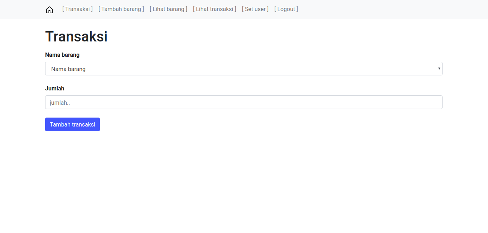
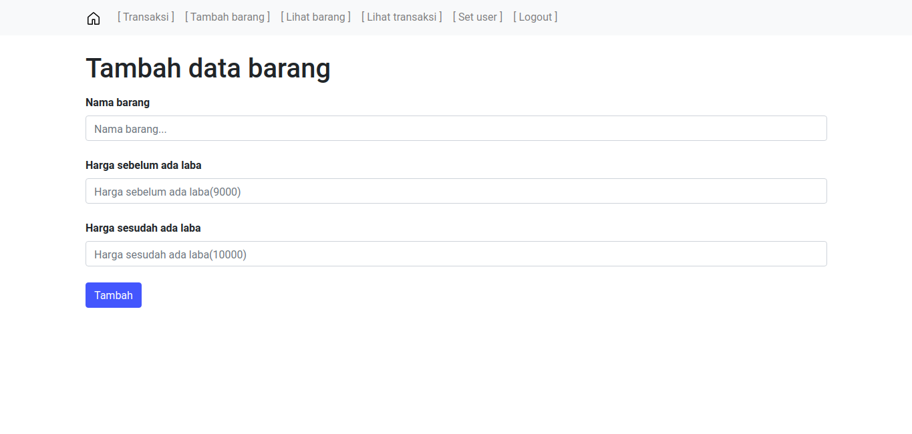
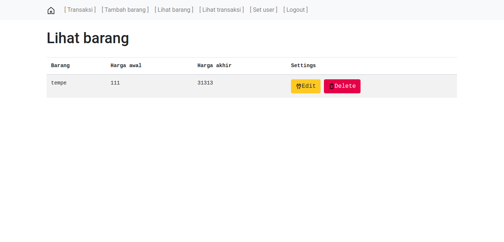
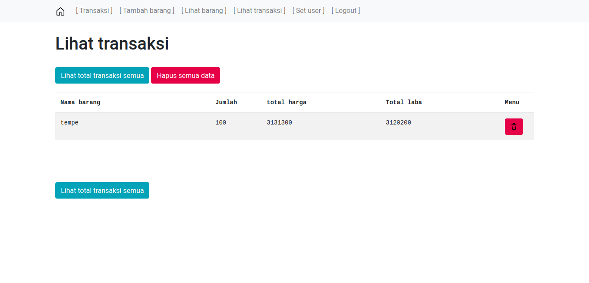

# Catatan Penghasilan Usaha
Catatan penghasilan usaha cocok untuk warung,toko,dll | ICWR-TECH
<br>
# -Dibuat dengan

```
1. PHP Native
2. Bootstrap
3. Jquery
4. HTML
5. CSS
```

# -Fitur

```
1. simpan Transaksi
2. Tambah barang
3. Sunting barang
4. Hapus barang
5. Lihat riwayat transaksi
6. Hapus riwayat transaksi berdasarkan ID
7. Hapus semua riwayat transaksi
8. Auto hitung laba
9. Auto hitung penghasilan
10. Tambah user
11. Hapus user,dll
```

# -Screenshots
<br>

<br>

<br>

<br>

<br>


# -Demo
http://tes-bro.000webhostapp.com
<br>
username = billy
<br>
password = billy
<br>
# -Catatan
```
Akun login default:
username: billy
password: billy
```
<br><br>
Sekian terimakasih:)
